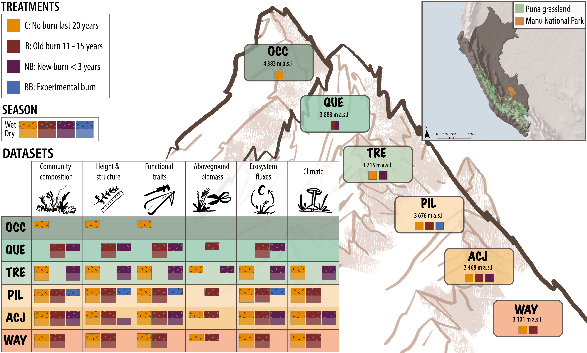

<style>
p.caption {
  font-size: 0.8em;
}
</style>

```{r setup, include=FALSE}
knitr::opts_chunk$set(
  collapse = TRUE,
  comment = "#>",
  message = FALSE,
  warning = FALSE
)

library("tidyverse")
library("lubridate")
library("readxl")
library("dataDownloader")
library("cowplot")
library("vegan")
library("ggvegan")
library("patchwork")
# knitr::read_chunk("data_paper/1_download_clean_data.R")
knitr::read_chunk("data_paper/2_data.R")
knitr::read_chunk("data_paper/2_make_figures.R")

theme_set(theme_bw(base_size = 12))
```


# PFTCourses, Elevational Gradient, Puna Project and Fire Experiment, Wayquecha, Peru

This is the git repository for the paper:
Vandvik et al. (prepring). Plant traits and vegetation data from climate warming experiments along an 1100 m elevation gradient in the alpine Puna grasslands, Wayquecha, Peru

This project reports on plant functional traits, vegetation, ecosystem, and climate data in response to fire treatments and along a 1000 m elevational gradient in Puna grasslands in southeastern Andes of Perú. Across six sites along the elevational gradient, we collected data in sites that differed in their fire history (i.e. recent vs. long time since burning). The data were collected between 2018 and 2020 as part of the international Plant Functional Traits Courses 3 and 5 (PFTC3 and PFTC5) and three master theses.


## Project and site information

Research site selection and basic site information. 
The study was conducted in the puna grasslands of the southeastern Andes, in the buffer zone of the Manu National Park, belonging to the district of Challabamba, province of Paucartambo and department of Cusco in Perú. 
The puna grasslands are located above the upper treeline limit of the cloud forest. At the border between the cloud forest and the puna grassland (c. 3000 m a.s.l. ), the annual rainfall is approximately 1560 mm and mean annual air temperature is 11.8 °C (Girardin et al. 2014). 
The dry season in these systems is between May/June and August/September and although there is less rain, fog dynamics from the rainforest keep still certain moisture in the system. 
The puna grasslands are dominated by tussock forming grasses and the dominant species are Calamagrostis, Stipa, and Festuca species (Oliveras et al. 2014). 
The puna vegetation are cultural landscapes and are used for grazing by livestock. 
There is no grazing inside the Manu National Park but the buffer area is commonly used by the surrounding local communities for extensive cattle grazing, and sometimes livestock do enter and graze within the Park (Oliveras et al. 2014). 
The soils have deep organic layers (20 cm on average, but they can be as much as 110 cm deep, Oliveras pers. obs.) (Gibbon et al. 2010; Zimmermann et al. 2010).
Six sites were selected along an elevational gradient above the cloud forest treeline (Table 1). In March 2019, five sites were established at Wayquecha (WAY; 3101 m a.s.l.), Acjanaco (ACJ; 3468 m a.s.l.), Pilco Grande (PIL; 3676 m a.s.l.), Tres Cruzes (TRE 3715 m a.s.l.) and Quello Casa (QUE; 3888 m a.s.l.). 
WAY belongs to the Private Conservation Area Wayqecha managed by ACCA (Oliveras et al. 2014), while all the other sites are located within the protected area of Manu National park. 
In April 2019, a sixth site Ocoruro (OCC; 4383 m a.s.l.) located in Calca province, outside of Manu National Park was established.


```{r echo=FALSE, out.width='60%', fig.cap= "Location of the six study sites along an elevational gradient"}

```


## The experimental set-up

**Fire treatments** At each site we selected areas that differed in the timing since the last burning: No burning since last 20 years (C; control), 11-15 years since burning (B; old burn), and < 3 years since burning (NB; new burn) (Van der Eynden 2011; Román-Cuesta et al. 2011; Imma Oliveras, personal communication)(Figure 1). 
All sites except QUE had control plots, while TRE and OCC lacked the burnt treatment. Recently burnt areas were only found at four sites (ACJ, PIL, TRE, QUE). 
The QUE site burnt in November 2019 and therefore changed from a burnt to a recently burnt site. 
At PIL, an area was experimentally burnt in 2006 and 2013 (BB; experimental burn).


## DATASETS, CODE AND ANALYSES
The raw and cleaned datasets are stored on OSF PFTCourses, Elevational Gradient, Puna Project and Fire Experiment, Wayquecha, Peru: https://osf.io/gs8u6/

The data was processed and analysed using R. All code is stored on github: https://github.com/Plant-Functional-Trait-Course/pftc3_punaproject_pftc5

### Download data
To download the data, the following function can be used:

```{r InstallPackages, eval=FALSE, echo=TRUE}
#install.packages("remotes")
#remotes::install_github("Plant-Functional-Trait-Course/PFTCFunctions")

library("PFTCFunctions")
```

```{r DownloadExample, eval=FALSE, echo=TRUE}
#Download files from OSF
download_PFTC_data(country = "Peru", 
                   datatype = "community", 
                   path = "data")
```

Use the following specifications to download the data:
```{r showCode, echo = TRUE, eval=FALSE}
data("location", package = "PFTCFunctions")
```

```{r showTable, eval=TRUE, echo=FALSE}
data("location", package = "PFTCFunctions")
location %>% 
  select(Country, DataType, Remark) %>% 
  filter(Country == "Peru") %>% 
  knitr::kable()
```


Note that the raw data and the code to clean the raw data is also available on OSF and the GitHub repository.


### Community Dataset
All vascular plant species in each plot were surveyed between 2018 and 2020. At each survey, vegetation was surveyed using a 1m x 1m square. We registered presence-absence of all species in 25 subplots (???) per plot and estimated the percentage coverage of each species in the whole plot. Note that the total coverage in each plot can exceed 100 due to layering of the vegetation. Mean vegetation height for each plot was measured, at five points per plot.

To download the clean data use: `data_paper/1_download_clean_data.R`


#### Data cleaning steps
All data was manually entered from into digital worksheets, and manually proofread.

All data cleaning and checking was done using code. The data was checked and corrected for spelling mistakes and mislabeled. Missing information (e.g. PlotID, Site) were added if possible. The data was then checked visually to detect apparent measurement errors.

Explain problems with species identification.


#### Diversity along elevational gradient

```{r DiversityPlot, echo=FALSE, eval=FALSE, fig.cap="Figure 3 add fig legend."}
```


```{r OrdinationPlot, echo=FALSE, eval=FALSE, fig.cap="Figure 4 Community response to experimental temperature change including Open Top Chamber warming, transplantation to warmer sites, and transplantation to colder sites across the 4 study sites."}
```


### Vegetation height and structure dataset
Vegetation height and structure data for each plot was recorded between 2018 and 2020. Mean vegetation height and bryophyte depth was measured at five evenly spaced points per plot using a ruler. The percent coverage of vascular plant vegetation was also recorded. Obvious outliers in the data were removed.

Vegetation height increases in the first 3 years and then decreases, because biomass accumulates inside the fence over time (no grazing). After 2014 the vegetation inside the fence was clipped at the end of the field season to remove this fence effect. 


### Functional leaf trait dataset

#### Leaf traits measurements
Leaves from the most common species in the plant community were collected at each of the six sites between 2018 and 2020. We aimed to collect one healthy, fully expanded leaf from up to five individuals for each species at each site where they occurred. This was not possible for all species at all sites. To avoid repeated sampling from a single clone, we selected individuals that were visibly separated from other stems of that species.

The dataset contains eleven functional traits related to potential physiological rates and environmental tolerance of plants. These include: 

- leaf area (LA, cm^2^ ) 
- leaf thickness (LT, mm)
- leaf dry matter content (LDMC, g/g)
- specific leaf area (SLA, cm^2^ /g)
- carbon (C, %)
- nitrogen (N, %)
- phosphorus (P, %)
- carbon:nitrogen ratio (C:N)
- nitrogen:phosphorus (N:P)
- carbon13 isotope (δ ^13^C, ‰)
- nitrogen15 isotope (δ ^15^N, ‰)


The traits were measured according to Pérez-Harguindeguy et al. (2012) as well as the Enquist Macrosystems protocol with the following modifications: 

##### Leaf area in cm^2^ 

Each leaf (including petiole) was cut from the stem. Leaf area was measured with a flatbed scanner, set on 300dpi, and used with colours to provide maximal information. The leaves were carefully flattened and laid down in the position that gave the largest area before measurement to avoid squashing, overlapping or curled leaves. To determine the leaf area in squared centimeters ImageJ was used with the Ben Bolder’s macro method.  

Simple leaves - Leaf lamina and petioles are measured independently for 5 leaves per individual, when possible. The petiole and lamina are then scanned and area is measured.
Compound leaves - The rachis and petiole was removed. The fresh area was measured for the rachis and petiole of 5 leaves including all leaflets and petiolules per individual. The area of the rachis plus petiole was measured separately from the lamina plus petiolules.

##### Leaf mass in grams

Wet leaf mass was measured in grams. Leaves was then dried at 60-65°C for 72 hours and weighed for dry mass in grams.

##### Leaf thickness

The leaf thickness was measured carefully with a digital micrometer. Three random spots were selected for each leaf that includes midrib, lamina with veins and lamina without veins. The average value of these three spots was used to obtain leaf thickness. Some leaves were so small that three spots measurement was impossible. On this small leaves only one or two spots were measured and then this was used to get the average value. 

##### Specific leaf area

Whole leaf SLA. Specific leaf area is calculated from the leaf area for the whole leaf (measured with the scanner), divided by the dry mass (measured after 72 hours drying) for the whole leaf. SLA = leaf area (cm^2^)/dry mass (g).

##### Leaf Dry Matter Content 

LDMC was measured with the leaf dry mass divided by the leaf wet mass. 
LDMC = Leaf dry mass (g)/ leaf wet mass (g).  


To download the clean data use: `data_paper/1_download_clean_data.R`


#### Traits Distributions and Values

```{r TraitDistribution, echo=FALSE, eval=FALSE, fig.cap= "Distributions of trait data from all sampled leaves from the six sites along the elevational gradient."}
```

```{r TraitChecks, echo=FALSE, eval=FALSE, fig.cap= "Scatterplots of wet vs. dry mass and leaf area vs. dry mass."}
```

#### Data processing and cleaning 
All data was manually entered from into digital worksheets, and manually proofread.

All data cleaning and checking was done using code. The data was checked and corrected for spelling mistakes and mislabelling. Missing or mislabeled information (e.g. elevation, site, taxon, individual and leaf numbers, location, project) were added or corrected if possible. Duplicated entries were removed. The taxonomy was checked.
The data was then checked visually to detect apparent measurement errors. Unrealistic values were removed. For the trait data this included leaves with leaf dry matter values higher than 1 g/g, leaves with specific leaf area values greater than 600 cm^2^ /g.


##### General checking, cleaning and flagging data
TBA
* Leaves that have white on the leave scan
* outlier?
* area estimated?


### Carbon flux data

TBA


### Climate data

- Air (15 cm), ground (0 cm) and soil temperature (-6 cm) and volumetirc soil moisture from Tomst loggers betwee X and Y.

To download the clean data use: `data_paper/1_download_clean_data.R`


#### Data processing
The data was provided in excel or csv files. The data was checked visually for outliers. Outliers and unrealistic values were removed.


```{r Climate figure, echo=FALSE, eval=FALSE, fig.cap= "Temperature data from the sites along the 1100 m elevation gradient and open top chambers at Mt. Gongga. (a) Continuous (10 minute interval) temperature at 2 m above ground from the climate stations (dataset v), (b) mean temperature during tthe growing season (June-September) at 30 cm above ground inside and outside OTCs at each site (dataset vi), and (c) monthly mean temperatures at 15 cm above ground, at ground leve, and 6 cm below ground in the OTCs at the High alpine site."}
```

