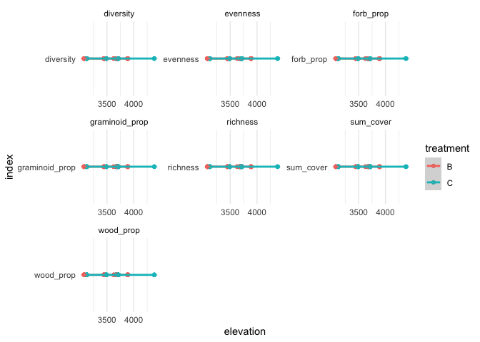

<style>
p.caption {
  font-size: 0.8em;
}
</style>

# PFTCourses, Elevational Gradient, Puna Project and Fire Experiment, Wayquecha, Peru

This is the git repository for the paper: Vandvik et al. (prepring).
Plant traits and vegetation data from climate warming experiments along
an 1100 m elevation gradient in the alpine Puna grasslands, Wayquecha,
Peru

## PROJECT AND SITE INFORMATION

This project reports on plant functional traits, vegetation, ecosystem,
and climate data in response to fire treatments and along a 1000 m
elevational gradient in Puna grasslands in southeastern Andes of Perú.
Across six sites along the elevational gradient, we collected data in
sites that differed in their fire history (i.e. recent vs. long time
since burning). The data were collected between 2018 and 2020 as part of
the international Plant Functional Traits Courses 3 and 5 (PFTC3 and
PFTC5) and three master theses.

<div class="figure">


<p class="caption">

Location of the six study sites along an elevational gradient

</p>

</div>

## The experimental set-up

Something on fire, sites, plots etc.

## DATASETS, CODE AND ANALYSES

The raw and cleaned datasets are stored on OSF PFTCourses, Elevational
Gradient, Puna Project and Fire Experiment, Wayquecha, Peru:
<https://osf.io/gs8u6/>

The data was processed and analysed using R. All code is stored on
github:
<https://github.com/Plant-Functional-Trait-Course/pftc3_punaproject_pftc5>

### Download data

To download the data, the following function can be used:

``` r
#install.packages("remotes")
#remotes::install_github("Plant-Functional-Trait-Course/PFTCFunctions")

library("PFTCFunctions")
```

``` r
#Download files from OSF
download_PFTC_data(country = "Peru", 
                   datatype = "community", 
                   path = "data")
```

Use the following specifications to download the data:

``` r
data("location", package = "PFTCFunctions")
```

| Country | DataType      | Remark |
| :------ | :------------ | :----- |
| Peru    | community     |        |
| Peru    | metaCommunity |        |
| Peru    | trait         |        |
| Peru    | flux          |        |
| Peru    | meta          |        |

### Functional leaf trait dataset

#### Leaf traits measurements

Leaves from the most common species in the plant community were
collected at each of the six sites between 2018 and 2020. We aimed to
collect one healthy, fully expanded leaf from up to five individuals for
each species at each site where they occurred. This was not possible for
all species at all sites. To avoid repeated sampling from a single
clone, we selected individuals that were visibly separated from other
stems of that species.

The dataset contains eleven functional traits related to potential
physiological rates and environmental tolerance of plants. These
include:

  - leaf area (LA, cm<sup>2</sup> )
  - leaf thickness (LT, mm)
  - leaf dry matter content (LDMC, g/g)
  - specific leaf area (SLA, cm<sup>2</sup> /g)
  - carbon (C, %)
  - nitrogen (N, %)
  - phosphorus (P, %)
  - carbon:nitrogen ratio (C:N)
  - nitrogen:phosphorus (N:P)
  - carbon13 isotope (δ <sup>13</sup>C, ‰)
  - nitrogen15 isotope (δ <sup>15</sup>N, ‰)

The traits were measured according to Pérez-Harguindeguy et al. (2012)
as well as the Enquist Macrosystems protocol with the following
modifications:

##### Leaf area in cm<sup>2</sup>

Each leaf (including petiole) was cut from the stem. Leaf area was
measured with a flatbed scanner, set on 300dpi, and used with colours to
provide maximal information. The leaves were carefully flattened and
laid down in the position that gave the largest area before measurement
to avoid squashing, overlapping or curled leaves. To determine the leaf
area in squared centimeters ImageJ was used with the Ben Bolder’s macro
method.

Simple leaves - Leaf lamina and petioles are measured independently for
5 leaves per individual, when possible. The petiole and lamina are then
scanned and area is measured. Compound leaves - The rachis and petiole
was removed. The fresh area was measured for the rachis and petiole of 5
leaves including all leaflets and petiolules per individual. The area of
the rachis plus petiole was measured separately from the lamina plus
petiolules.

##### Leaf mass in grams

Wet leaf mass was measured in grams. Leaves was then dried at 60-65°C
for 72 hours and weighed for dry mass in grams.

##### Leaf thickness

The leaf thickness was measured carefully with a digital micrometer.
Three random spots were selected for each leaf that includes midrib,
lamina with veins and lamina without veins. The average value of these
three spots was used to obtain leaf thickness. Some leaves were so small
that three spots measurement was impossible. On this small leaves only
one or two spots were measured and then this was used to get the average
value.

##### Specific leaf area

Whole leaf SLA. Specific leaf area is calculated from the leaf area for
the whole leaf (measured with the scanner), divided by the dry mass
(measured after 72 hours drying) for the whole leaf. SLA = leaf area
(cm<sup>2</sup>)/dry mass (g).

##### Leaf Dry Matter Content

LDMC was measured with the leaf dry mass divided by the leaf wet mass.
LDMC = Leaf dry mass (g)/ leaf wet mass (g).

To download the clean database use: `XXX/Download_Data.R`

#### Traits Distributions and Values


#### Data processing and cleaning

All data was manually entered from into digital worksheets, and manually
proofread.

All data cleaning and checking was done using code. The data was checked
and corrected for spelling mistakes and mislabelling. Missing or
mislabeled information (e.g. elevation, site, taxon, individual and leaf
numbers, location, project) were added or corrected if possible.
Duplicated entries were removed. The taxonomy was checked. The data was
then checked visually to detect apparent measurement errors. Unrealistic
values were removed. For the trait data this included leaves with leaf
dry matter values higher than 1 g/g, leaves with specific leaf area
values greater than 600 cm<sup>2</sup> /g.

##### General checking, cleaning and flagging data

  - Leaves that have white on the leave scan
  - outlier?
  - area estimated?

### Community Dataset

All vascular plant species in each plot were surveyed between 2018 and
2020. At each survey, vegetation was surveyed using a 1m x 1m square. We
registered presence-absence of all species in 25 subplots (???) per plot
and estimated the percentage coverage of each species in the whole plot.
Note that the total coverage in each plot can exceed 100 due to layering
of the vegetation. Mean vegetation height for each plot was measured, at
five points per plot.

To download the clean database use: `XXX/Download_Data.R`

#### Data cleaning steps

All data was manually entered from into digital worksheets, and manually
proofread.

All data cleaning and checking was done using code. The data was checked
and corrected for spelling mistakes and mislabeled. Missing information
(e.g. PlotID, Site) were added if possible. The data was then checked
visually to detect apparent measurement errors.

Explain problems with species identification.

#### Diversity along elevational gradient



### Vegetation height and structure dataset

Vegetation height and structure data for each plot was recorded between
2018 and 2020. Mean vegetation height and bryophyte depth was measured
at five evenly spaced points per plot using a ruler. The percent
coverage of vascular plant vegetation was also recorded. Obvious
outliers in the data were removed.

Vegetation height increases in the first 3 years and then decreases,
because biomass accumulates inside the fence over time (no grazing).
After 2014 the vegetation inside the fence was clipped at the end of the
field season to remove this fence effect.

### Climate data

  - Air (15 cm), ground (0 cm) and soil temperature (-6 cm) and
    volumetirc soil moisture from Tomst loggers betwee X and Y.

To download the clean data use: `XXX/Download_Data.R`

#### Data processing

The data was provided in excel or csv files. The data was checked
visually for outliers. Outliers and unrealistic values were removed.
